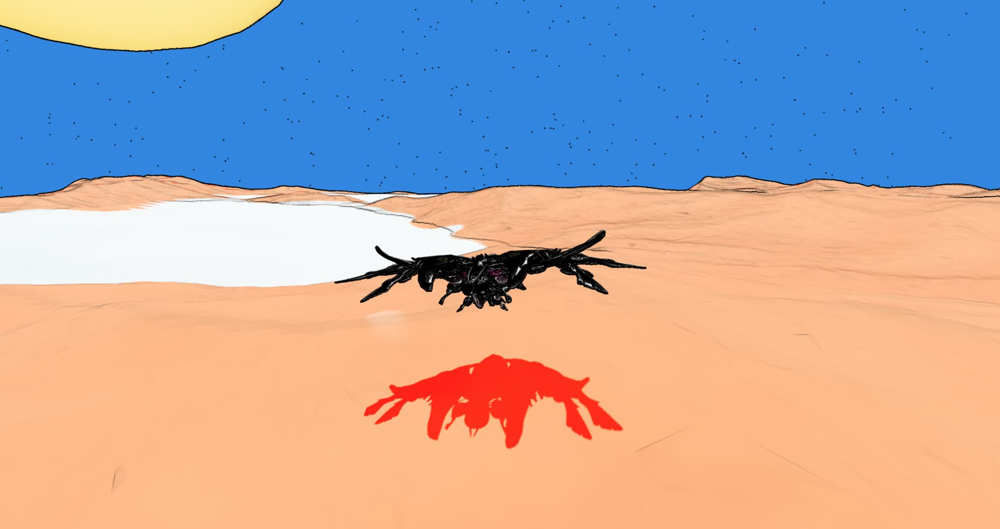

# NFT-ZONES

Each gameplay in STAR-EX has its own terrain settings, world-building, and challenges, which we called it as zones. Zones will be represented as NFTs, allowing players to explore, acquire from the system, mint for re-entry, trade with other players, or craft them. Zones will be divided into multiple categories, each impacting gameplay and challenges:

* Planets
* Outposts
* Dungeons
* Arenas
* Simulations

These zones will offer unique gameplay and challenges. Additionally, zones can serve as a pool for staking, providing players with incentives. For now, zones will be ERC-1155 tokens to complement the supply system and meet player demands. We are considering it to move it into ERC-404 in the future.\

<figure><figcaption>
Zone Outpost
</figcaption></figure>

<figure><figcaption>
Zone Outpost
</figcaption></figure>

<figure><figcaption>
Zone planet
</figcaption></figure>

<figure><figcaption>
From outpost [SPACE]
</figcaption></figure>

<figure><figcaption>
Exploring a Planet
</figcaption></figure>
