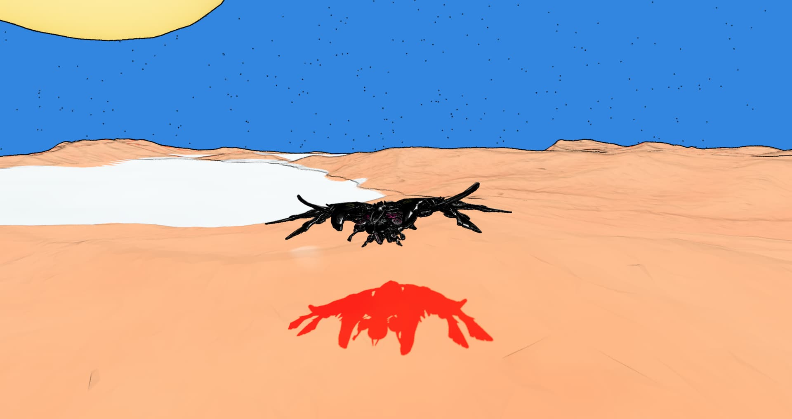

# Planet

Planets are similar to outposts, but they incorporate fantasy elements and have time-limited challenges with fixed resources. When players die or lose ships here, the planet's resources increase, which determines the planet's value over time. Items found on planets can include talismans or charms that increase crafting success rates. While anomaly experiences are less frequent on planets, they can still occur.

<figure><figcaption></figcaption></figure>
