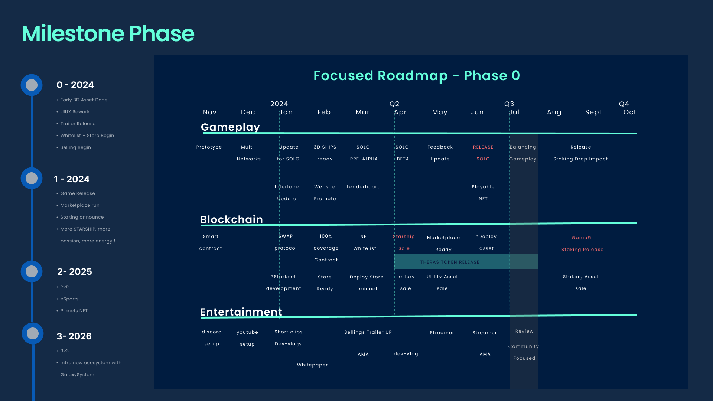
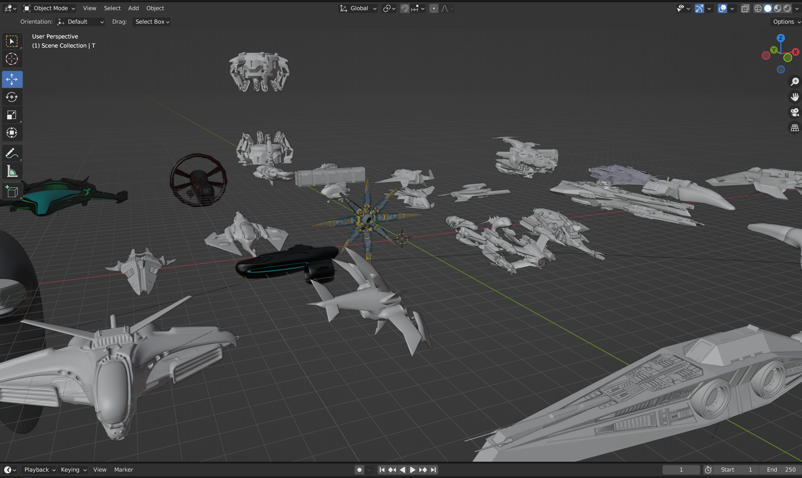

# V1 → V2

The project idea begins on November 2023, during development and hackathon, STAR-EX has shift into V2 on March 2024 (This is an upgrade and moving zones into NFTs and expand the gameplay into exploration, simulation, etc).

\
Here’s the breakdown between v1 and v2:\
V1:

* game play is racing survival only (Prototype)
* game-mode based on fixed events
* has crafting materials
* [previous game app 1](https://starex-klaytn.vercel.app/)
* [previous contracts 1](https://github.com/Theras-Labs/starex-contracts-prototype-v1/tree/9678b982c14c6a8e5517091dbebd984a1c8e2287)
* developed solo

<figure><figcaption>
ROADMAP OF V1 
</figcaption></figure>

V2:

* Heavily update on the structure for cross-chain interaction. This revolve the idea to build Theras as an agnostic tokenised protocol.
* Update the procedural generator for obstacle
* Update terrain including planets, and dungeons (hidden)
* Update game-mode now based on NFTs
* Add some sound effect, and visual effect
* Add integration to Theras-backend for crafting purpose and match leaderboard
* Add multiplayer
* Recruiting team, and growing community for WL registration soon (JUNE)
* Update inventory uiux, will be updating into v3 uiux as we have new designer lately.
* Update materials, tier, and required crafting components. (Will release the table soon)
* Update contract into upgradeable, and using THERAS-STANDARD-1155 from Theras Standard (NFT as ownership)
* Add new Airdrop Pool contract, and update play-contract (not finished, as not priority, will be explain in milestones)
* 3D Artist joining and partnership other 3D artist, and many starships to release on several batch.
* Development Team is growing

<figure><figcaption></figcaption></figure>
